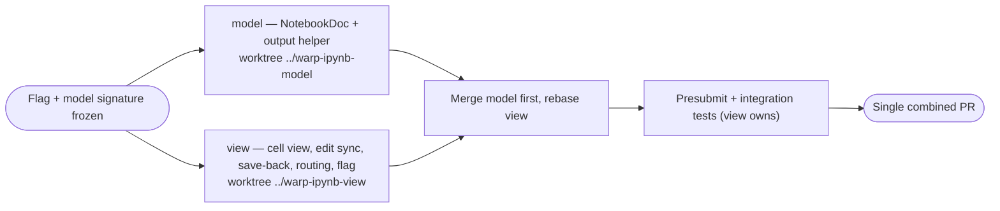

# Jupyter Notebook Editing (cell-based) — TECH v1
Implement an editable, cell-based `.ipynb` surface that round-trips to valid notebook JSON. Edit-only: no kernel, no execution; saved outputs are carried through untouched. Behind a feature flag. See `product_v1.md` for user-visible behavior.
## Context
The shipped render-only feature turns a `.ipynb` into a single read-only Markdown document. The pipeline is:
```
.ipynb JSON → ipynb_to_markdown() → one Markdown string → editor.reset_with_markdown() → single read-only Buffer in FileNotebookView
```
- The converter `ipynb_to_markdown` (`app/src/notebooks/file/ipynb.rs:51`) flattens the whole notebook into one Markdown string and deserializes only the handful of fields it renders (`Notebook`/`Cell`/`Output`, `app/src/notebooks/file/ipynb.rs (313-388)`). It has no serializer back to `.ipynb`.
- That string is fed to a single editor in `FileNotebookView::set_content` (`app/src/notebooks/file/mod.rs:338` → `maybe_render_ipynb` at `:357`) via `reset_with_markdown` (`crates/editor/src/model.rs:899`).
- The editor is explicitly read-only — `InteractionState::Selectable` (`app/src/notebooks/file/mod.rs:264`) — and there is no write-back: `FileModel` events only flow in (`FileUpdated → set_content`, `app/src/notebooks/file/mod.rs:527`; remote path at `:666`); `FileSaved`/`FailedToSave` are ignored (`:530`).
This blocks editing for structural reasons, not cosmetic ones: the projection is lossy and irreversible (cell boundaries, cell types, ids, metadata, and `execution_count` are all dropped), there is no mapping from buffer regions back to cells, and outputs are intermingled with editable source in one buffer. The shipped `TECH.md` ("Tradeoff" note, `specs/jupyter-notebook-rendering/TECH.md:54`) deliberately deferred a cell-based view; this spec builds it.
Infrastructure this feature reuses (all already editable and battle-tested):
- Editable rich-text/markdown editor with full Markdown round-trip: `RichTextEditorView` (`app/src/notebooks/editor/view.rs`) over `NotebooksEditorModel` (`app/src/notebooks/editor/model.rs:95`); parse via `reset_with_markdown` (`crates/editor/src/model.rs:899`) and serialize via `BufferMarkdownParser::to_markdown` (`crates/editor/src/content/markdown.rs:61`). This is exactly how editable Warp Drive notebooks work.
- Editable, syntax-highlighted code editor: `CodeEditorModel` (`app/src/code/editor/model.rs`, a `PlainTextEditorModel`) used by `CodeView` (`app/src/code/view.rs`), with language detection via the `languages` crate.
- File save-back with conflict detection: `FileModel::save(file_id, content, version, ctx)` (`crates/warp_files/src/lib.rs:682`) for local and remote, emitting `FileSaved`/`FailedToSave`; `FileUpdated` carries `base_version`/`new_version` (`crates/warp_files/src/lib.rs:52`) for stale-vs-conflict decisions.
- Open-flow routing chokepoint for `.ipynb`: `resolve_file_target_with_editor_choice` (`app/src/util/openable_file_type.rs:216`) and `resolve_file_target_to_open_in_warp` (`:176`), today returning `FileTarget::MarkdownViewer` for `.ipynb` when the flag is on.
## Proposed changes
The center of gravity moves from "text to render" to "a structured document whose cells are editable units." Markdown rendering is applied per markdown-cell source, not to the whole file.
**1. Lossless notebook model — `app/src/notebooks/file/ipynb_model.rs` (new)**
A round-trippable nbformat v4 model, separate from the render-only `ipynb.rs` converter:
```rust path=null start=null
pub struct NotebookDoc { /* nbformat, nbformat_minor, metadata, cells, + unknown */ }
pub enum CellKind { Markdown, Code, Raw }
pub struct CellDoc { id, kind, source: String, outputs: Vec<serde_json::Value>, metadata, execution_count, + unknown }
impl NotebookDoc {
    pub fn parse(json: &str) -> Result<Self, IpynbError>; // v4 only; else Err → fallback
    pub fn to_json_pretty(&self) -> String;                // stable, round-trippable
}
```
- Every level keeps a `#[serde(flatten)] extra: serde_json::Map<String, Value>` so unknown/unmodeled fields (and all `outputs`) survive a load→save round trip verbatim (PRODUCT invariants 11, 18).
- `source` is normalized to a single `String` on load (notebook `source` is string-or-`Vec<String>`) and re-split on save to match nbformat conventions.
- Outputs are stored as opaque `serde_json::Value` and never mutated by the editor; rendering reads them, saving writes them back unchanged.
**2. Cell-based view — `app/src/notebooks/file/jupyter/` (new view)**
A new `JupyterNotebookView` (sibling to `FileNotebookView`) owns the `NotebookDoc` plus a `Vec<CellViewState>` rendered as a scrollable column:
- markdown cell → an editable `RichTextEditorView`/`NotebooksEditorModel` (rendered WYSIWYG markdown).
- code cell → an editable `CodeEditorModel` configured with the notebook language for highlighting.
- outputs → read-only elements beneath the code editor, reusing the render rules already proven in `ipynb.rs` (stream/`text/plain`/traceback as preformatted text with ANSI stripped via `strip_ansi`; `image/png`/`image/jpeg` as embedded images; size guards). This logic can be lifted from `app/src/notebooks/file/ipynb.rs` into a shared output-render helper so display rules stay identical to v0.
- Each cell carries a gutter/affordance for structural ops (PRODUCT 8). A new view (not extending the single-buffer `FileNotebookView`) is required because there is no single buffer anymore — there are N independent editor models with their own focus/selection/undo.
**3. Edit ⇄ model sync**
- markdown cell: on edit, serialize that cell's buffer via `BufferMarkdownParser::to_markdown(MarkdownStyle::Export { .. })` into `CellDoc.source`.
- code cell: on edit, copy the code editor's plain text into `CellDoc.source` verbatim (preserve whitespace/newlines, PRODUCT 7).
- Edits set a per-notebook dirty flag and update `CellDoc` in place; untouched cells (and their `extra`/`outputs`) are never re-serialized through the editor (PRODUCT 6).
**4. Save-back + conflict handling**
- Save serializes `NotebookDoc::to_json_pretty()` and calls `FileModel::save(file_id, json, version, ctx)` (`crates/warp_files/src/lib.rs:682`), using the tracked `ContentVersion`. Wire `FileSaved`/`FailedToSave` (currently ignored at `app/src/notebooks/file/mod.rs:530`) to clear/retain the dirty flag and surface errors (PRODUCT 10–12).
- On `FileUpdated` (`crates/warp_files/src/lib.rs:52`): if not dirty, reload; if dirty, present a keep-vs-reload conflict instead of the current unconditional `set_content` overwrite (PRODUCT 13).
- When the path is not writable / remote host disconnected, disable save with indication (PRODUCT 21); the remote disconnect signal already observed in `open_remote` (`app/src/notebooks/file/mod.rs (631-642)`) can drive this.
**5. Routing + pane**
- Add a dedicated `FileTarget::JupyterNotebook(layout)` and a matching pane, rather than overloading `FileTarget::MarkdownViewer`. The v0 `TECH.md` avoided a new file-classification variant to keep the blast radius small (`specs/jupyter-notebook-rendering/TECH.md:24`); for an editable surface the dedicated target is worth the exhaustive-match churn because the notebook is no longer "a markdown viewer." Gate the new target in the same chokepoints (`app/src/util/openable_file_type.rs:216` and `:176`) behind the new flag; fall back to the v0/markdown behavior when the editing flag is off.
- `.ipynb` classification stays `OpenableFileType::Text` (unchanged), so non-routing surfaces are unaffected.
**6. Cell structural operations**
Insert/delete/move/convert (PRODUCT 8) are `NotebookDoc` mutations plus view re-sync: convert drops outputs/`execution_count` when code→markdown; new cells start empty with no outputs.
**7. Rendered⇄Raw toggle**
Keep the existing toggle, but when switching to Raw with unsaved edits, serialize the in-memory `NotebookDoc` into the JSON the `CodeView` opens (or warn) so edits are not lost (PRODUCT 19). The current toggle just swaps to a fresh `CodeView` on the on-disk file (`app/src/notebooks/file/mod.rs:1117`).
**8. Feature flag — `crates/warp_features/src/lib.rs`**
Add a new flag (e.g. `JupyterNotebookEditing`) distinct from the existing `JupyterNotebookRendering` (`crates/warp_features/src/lib.rs:511`), per the `add-feature-flag` skill (enum variant, `DOGFOOD_FLAGS`, `app/Cargo.toml` `[features]` entry, and the `#[cfg(feature = "...")]` bridge in `app/src/features.rs`). Gate routing, the new view/pane, and save-back.
## Testing and validation
Mapped to `product_v1.md` invariants:
- Lossless round trip (11, 18): unit tests on `NotebookDoc::parse`→`to_json_pretty` over fixtures that include unknown top-level/cell/output fields, all output MIME types, and string-vs-array `source`; assert byte-stable JSON for untouched notebooks.
- Per-cell edit fidelity (6, 7): unit/view tests that edit one markdown cell and one code cell and assert only those `source` fields change and whitespace is preserved.
- Cell ops (8): model tests for insert/delete/move/convert, including code→markdown dropping outputs.
- No execution / outputs untouched (9): assert editing source leaves `outputs` byte-identical on save.
- Open routing (1, 22): extend `app/src/util/openable_file_type_tests.rs` for both flag states (use `FeatureFlag::JupyterNotebookEditing.override_enabled(..)`): flag on → `JupyterNotebook`, flag off → unchanged.
- Outputs read-only & render parity (5): view tests that output regions reject text entry; reuse/extend the v0 render unit tests in `app/src/notebooks/file/ipynb_tests.rs`.
- Save + dirty + failure (10–12) and conflict (13): view/integration tests driving `FileModel` `FileSaved`/`FailedToSave`/`FileUpdated`; mirror `app/src/notebooks/file/mod_tests.rs`.
- Display truncation vs saved bytes (17): test that an oversized output is visually capped but serialized in full.
- Fallback (16): malformed/non-v4 input → `parse` returns `Err` and the view opens the raw JSON code editor (never blank/panic).
- Toggle (19): view tests asserting unsaved edits survive Rendered→Raw.
- Local + remote (20): integration parity for both paths.
Run `./script/format` and `cargo clippy` (per `WARP.md`) before PR.
## Parallelization
The work splits cleanly along a frozen model interface (`NotebookDoc::{parse,to_json_pretty}` + `CellDoc`), which has zero UI coupling. Freeze that signature first, then run two local agents on separate worktrees off `master`, with the routing/flag wiring folded into the view agent (too small to isolate).
- **model** (local) — owns `app/src/notebooks/file/ipynb_model.rs` + its unit tests, and the shared output-render helper lifted from `ipynb.rs`. Worktree `../warp-ipynb-model`, branch `oz/ipynb-model`. No other files.
- **view** (local) — owns the new `jupyter/` view/pane, edit⇄model sync, save-back/conflict handling, routing chokepoint changes, toggle, and the feature flag, against the frozen model interface (stubbed until merge). Worktree `../warp-ipynb-view`, branch `oz/ipynb-view`.
Merge `model` first, then rebase `view` and land a single combined PR. Validation (presubmit + integration tests) is owned by `view` after merge.

## Risks and mitigations
- **Many editor instances** (one per cell) can stress focus/selection/undo and large-notebook performance. Mitigate with per-cell models, a single focused-cell at a time, and viewport virtualization for very large notebooks (render off-screen cells lazily).
- **Markdown round-trip drift** — serializing an untouched markdown cell could reflow it. Mitigate by only re-serializing cells the user actually edited (invariant 6) and adding golden round-trip tests.
- **Save data loss / conflicts** — never overwrite on `FileUpdated` while dirty; gate save on `ContentVersion`; keep edits in-buffer on failure.
- **Display vs file fidelity** — display truncation/omission must operate on a copy; the saved bytes come from `NotebookDoc`'s untouched `outputs` (invariant 17).
- **Undo scope** — decide and document per-cell undo vs notebook-wide; v1 can scope undo per cell and treat structural ops as notebook-level history.
## Follow-ups
- Cell execution on a Python kernel (separate, much larger: Jupyter ZeroMQ protocol client + kernel process management).
- "Clear outputs" and "clear all outputs" affordances (cheap once the model exists).
- `text/html` / table / LaTeX / widget output rendering fidelity.
- A `prefer_notebook_viewer` setting mirroring `prefer_markdown_viewer`.
- Telemetry for notebook edits/saves.
